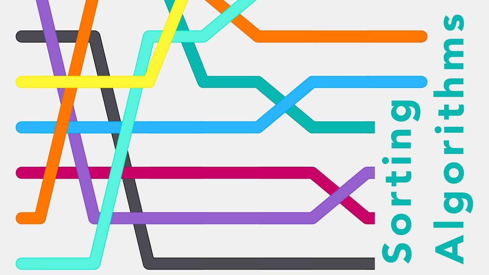
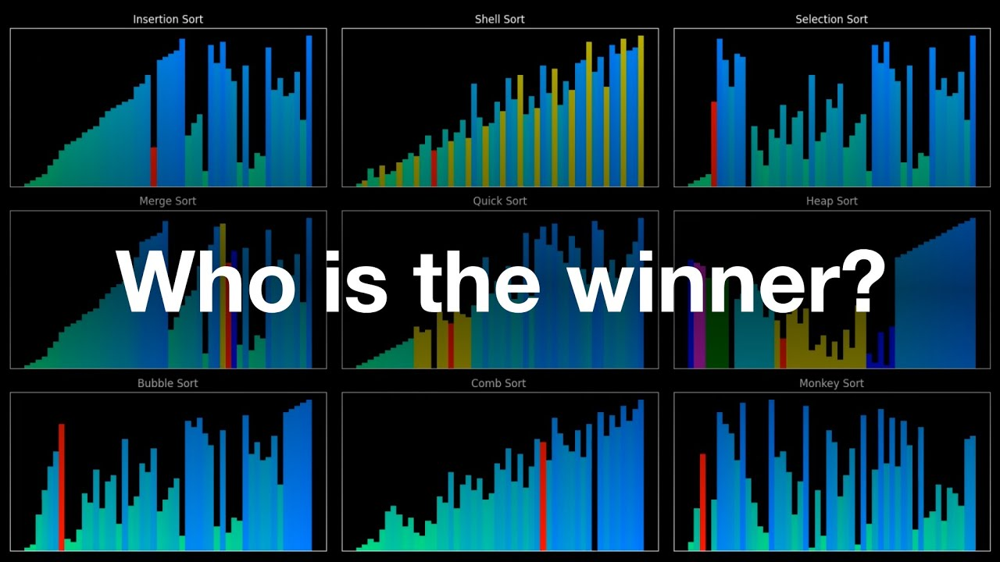

<a id='anchor'></a>

# Алгоритмы сортировки


## Сортировка пузырьком (bubble sort)
***
 На каждой итерации элементы массива сравниваются попарно. Если предыдущий элемент больше следующего — элементы меняются местами. В итоге самое большое число гарантировано окажется в конце массива. 
```
def bubble_sort(nums: list[int]) -> list[int]:
    i = 1
    while i < len(nums):
        for j in range(len(nums) - i):
            if nums[j] > nums[j + 1]:
                nums[j], nums[j + 1] = nums[j + 1], nums[j]
        i += 1
    return nums
```

## Сортировка выбором (selection sort)
***
Каждый проход в еще неотсортированной части массива выбирается минимальный элемент, который затем помещается в конец отсортированной части.
```commandline
def selection_sort(nums: list[int]) -> list[int]:
    c = len(nums)
    for i in range(c):
        current_min = nums[i]
        min_index = i
        for j in range(i, c):
            if nums[j] < current_min:
                current_min = nums[j]
                min_index = j
        nums[i], nums[min_index] = nums[min_index], nums[i]
    return nums
```

## Сортировка вставками (intersection sort)
***
Алгоритм сортировки вставками последовательно помещает каждый элемент из неотсортированной части на правильную позицию отсортированной части.
```
def intersection_sort(nums: list[int]) -> list[int]:
    for i in range(1, len(nums)):
        tmp = nums[i]
        j = i - 1
        while j >= 0 and nums[j] > tmp:
            nums[j + 1] = nums[j]
            j -= 1
        nums[j + 1] = tmp
    return nums
```
## Быстрая сортировка (quick sort)
***
Алгоритм рекурсивный. Сначала выбирается опорный элемент. Затем все элементы распределяются в подмассивы: меньше, больше опорного или равные ему. Выполняется до тех пор, пока в подмассиве остается не меньше двух элементов.
```commandline
def quicksort(nums: list[int]) -> list[int]:
    if len(nums) <= 1:
        return nums
    N = len(nums)
    pivot = nums[N // 2]
    left = []
    right = []
    equal = []
    for i in nums:
        if i < pivot:
            left.append(i)
        if i > pivot:
            right.append(i)
        if i == pivot:
            equal.append(i)
    return quicksort(left) + equal + quicksort(right)
```
[What's the fastest way to alphabetize your bookshelf? ](https://www.youtube.com/watch?v=WaNLJf8xzC4)

## Сортировка слиянием (merge sort)
***
Алгоритм действует по принципу "Разделяй и властвуй". Массив разделяется на две равные части, которые сортируются отдельно. Затем при слиянии отсортированных массивов получается один.
```commandline
def merge_sort(left: list[int], right: list[int]) -> list[int]:
    N, M = len(left), len(right)
    if N == 0 and M == 0:
        return []
    if N == 1 and M == 1:
        res = [*min(left, right), *max(left, right)]
        return res
    i = j = 0
    merge = []
    while i < N and j < M:
        if left[i] <= right[j]:
            merge.append(left[i])
            i += 1
        else:
            merge.append(right[j])
            j += 1
    merge += left[i:] + right[j:]
    return merge


def split_and_merge(nums: list[int]) -> list[int]:
    pivot = len(nums) // 2
    left, right = nums[:pivot], nums[pivot:]

    if len(left) > 1:
        left = split_and_merge(left)
    if len(right) > 1:
        right = split_and_merge(right)

    return merge_sort(left, right)
```
***

## Таблица сравнения
| __Алгоритм cортировки__ | __TC (худ. сл.)__ | __TC (ср. сл.)__ |   __SC__ |
|:------------------------|:------------------|:-----------------|---------:|
| bubble sort             | O(N^2)            | O(N^2)           |     O(1) |
| selection sort          | O(N^2)            | O(N^2)           |     O(1) |
| intersection sort       | O(N^2)            | O(N^2)           |     O(1) |
| __quick sort__          | O(N^2)            | O(nlogn)         | O(nlogn) |
| __merge sort__          | O(nlogn)          | O(nlogn)         |     O(N) |

***
### Используемые источники:
#### [Sorting Algorithms in Python](https://realpython.com/sorting-algorithms-python/)
#### [Визуализация 5 алгоритмов сортировки на Python](https://habr.com/ru/companies/kts/articles/727528/)


[Вверх](#anchor)